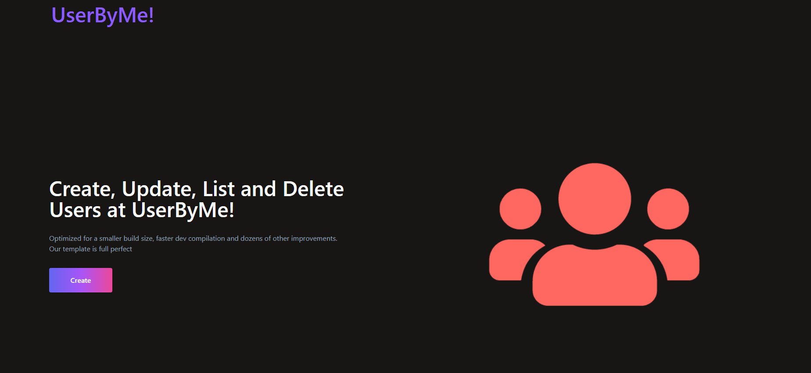
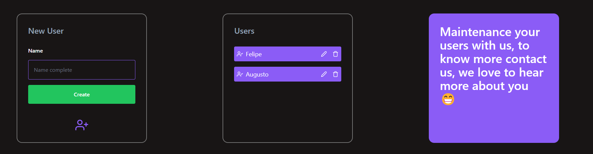

<p align="center">
   
</p>

# Podcast


[](https://github.com/Felipeact)
[](#)


> Explore new UsersByMe and More.

<br />
<p align="center"></p>
<p align="center"></p>

---

# :pushpin: Table of Contents

* [Features](#rocket-features)
* [Installation](#construction_worker-installation)
* [Getting Started](#runner-getting-started)
* [FAQ](#postbox-faq)
* [Found a bug? Missing a specific feature?](#bug-issues)
* [Contributing](#tada-contributing)
* [License](#closed_book-license)


# :construction_worker: Installation

**You need to install [Node.js](https://nodejs.org/en/download/) and [Yarn](https://yarnpkg.com/) first, then in order to clone the project via HTTPS, run this command:**

```git clone https://github.com/Felipeact/GraphQl-Application.git```

SSH URLs provide access to a Git repository via SSH, a secure protocol. If you have a SSH key registered in your Github account, clone the project using this command:

```git@github.com:Felipeact/GraphQl-Application.git```

GitHub CLI

```gh repo clone Felipeact/GraphQl-Application```

**Install dependencies**

```yarn install```

# :runner: Getting Started

**Frontend**

Run the following command in order to start the application in a development environment:

```yarn dev```

**Backend**

Run the following command in order to start the application in a development environment:

```npm run dev```

# :postbox: Faq

**Question:** What are the technologies used in this project?

**Answer:** The tecnologies used in this project are [ReactJS](https://reactjs.org/) + [Graphql](https://graphql.org/) to handle Http mutations and queries & [NodeJS](https://nodejs.org/en/) for comunicating backends between each other [Tailwind](https://tailwindcss.com/) to handle the styles architecture and a better maintenance than normal CSS and [Apollo](https://www.apollographql.com/) for creating only one url for frontend requests.
##

##


# :bug: Issues

Feel free to **file a new issue** with a respective title and description on the the [GraphQl-Application](https://github.com/Felipeact/GraphQl-Application/issues) repository. If you already found a solution to your problem, **i would love to review your pull request**! Have a look at our [contribution guidelines](https://github.com/Felipeact/GraphQl-Application/blob/main/CONTRIBUTING.md) to find out about the coding standards.

# :tada: Contributing

Check out the [contributing](https://github.com/Felipeact/GraphQl-Application/blob/main/CONTRIBUTING.md) page to see the best places to file issues, start discussions and begin contributing.


Made with love by [Felipe Viana](https://github.com/Felipeact) 🚀